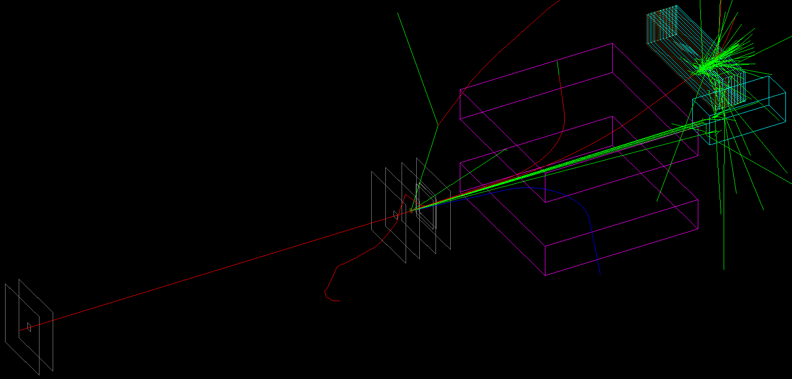

# succosim

This is **succosim**, a [Geant4](http://www.geant4.org/geant4/) blank template meant to be used as a starting point to create beamtest software simulations. It has been developed, starting from the material made available at the VII International Geant4 School, Krakow ([here](http://geant4.lngs.infn.it/krakow2019/)), with a focus on the typical experimental configurations of the INSULAb group beamtests &mdash; see, for example, [here](https://indico.cern.ch/event/731649/contributions/3237202/) and [here](http://cds.cern.ch/record/2672249). The aim of the project is twofold:

- to provide a tool to validate the experimental results by comparing them with simulated data that are as similar as possible to the real ones;
- to provide a tool to easily reproduce the beamtest experimental condition in the simulations without the need for a developer-level knowledge of C++ and Geant4.

Nevertheless, a basic, user-level understanding of how a Geant4 simulation works is required in order to exploit succosim to its full potential. Moreover, both Geant4 and [CMAke](https://cmake.org/) need to be installed on your machine in order to compile and run the software.

The succosim source code can be downloaded either as a ZIP archive, from the Code drop-down menu [here](https://github.com/mattiasoldani/anaKrys), or directly from the terminal (open in your project working directory) via
```shell
git clone git://github.com/mattiasoldani/succosim.git
```
Note: the latter requires  [Git](https://git-scm.com/) installed on your machine.

Tested with:

[](http://www.geant4.org/geant4/) [](https://cmake.org/)

Found a bug? Or simply have any questions, comments or suggestions you'd like to talk about? Feel free to contact me at <mattiasoldani93@gmail.com>. And brace yourself, for the best is yet to come!

---

### Settings

---

### Test mode

<p align="center">
    
</p>

---

### Output
